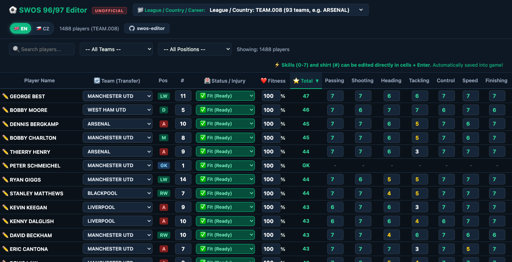

# ⚽ SWOS 96/97 Editor (Unofficial)

> **Unofficial web-based Save & Player Editor for Sensible World of Soccer (SWOS 96/97 PC DOS).**

Supports editing both the main league database files (`TEAM.*`) and career save files (`*.CAR`) directly from a modern web browser interface with real-time persistence.



---

## ✨ Features

- **Dual Mode (Leagues & Careers)**:
  - Edit all national leagues and teams from `DATA/TEAM.*`.
  - Edit saved careers (`*.CAR`), properly loading and writing back the manager's active squad at offset `56192` (including substitutes/reserves up to 30 players) as well as league teams from offset `2`.
- **Player Attribute & Skill Editing**:
  - Direct inline editing of all 7 SWOS skills (Passing, Shooting, Heading, Tackling, Control, Speed, Finishing) on the official SWOS scale of `0 - 7`.
  - Automatic recalculation of player overall score.
  - Shirt number (`#`) modification.
- **Career Health & Fitness Management**:
  - Live fitness percentage (`0 - 100%`) slider and inline editing with color-coded progress bars.
  - Status & injury management: Fit, Minor Injury, Severe Injury, Yellow Card, Match Suspension / Ban.
- **Transfers & Swaps**:
  - Transfer players between teams via inline dropdown or player card modal.
  - Automatic career squad index synchronization.
- **Bilingual Interface**:
  - Instant toggle between English (`🇬🇧 EN`) and Czech (`🇨🇿 CZ`) without page reloads.
  - Preference saved in `localStorage`.
- **Safety**:
  - Automatic backup creation (`*.bak`) prior to making file modifications.

---

## 🚀 Quick Start

### Requirements
- Python 3.8+
- Modern web browser

### Run
Place `swos_editor.py` into your SWOS root directory (where `DATA/` and your `*.CAR` files reside) and run:

```bash
python3 swos_editor.py
```

Options:
```text
--port PORT        Set web server port (default: 8096)
--no-browser       Do not automatically open the default web browser
```

Open `http://127.0.0.1:8096` in your browser.

---

## ⚠️ Disclaimer
This is an **unofficial** community tool created for preservation and enjoyment of retro games. Sensible World of Soccer (SWOS) is a registered trademark and copyright of Sensible Software / Codemasters.
